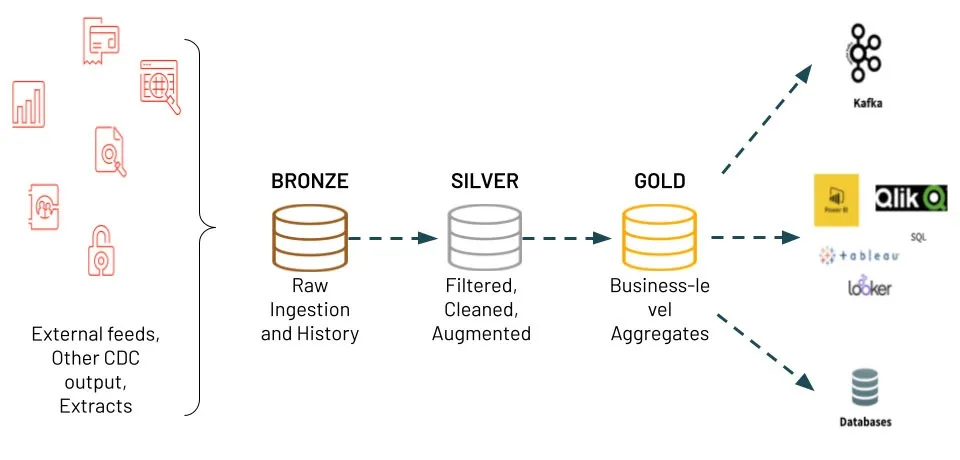

## AWS Datalake (ETL Medallion Architecture)

Programmatic ETL (Extract, Transform, Load) based on crime incidents in Chicago.

- Programmatic data ingestion from Data.gov API
- pogrammatic AWS S3 bucket creation, file object uploads, object mamangement

### Medallion Architecture

- Bronze : initial landing & raw data
- Silver : “some transformations”
- Gold : primed for consumption (Analysis in PowerBI)



## 📊 Data Source

**Chicago Crimes Dataset (2001 to Present)**

- **Ingestion Frequency**: Daily
- **Total Records**: ~8.19M
- **Columns**: 22
- **Data Source**: [Chicago Data Portal](https://data.cityofchicago.org/Public-Safety/Crimes-2001-to-Present/ijzp-q8t2/about_data)

## Quick Start

### 1. Clone Repo & Environment Setup

```bash
# clone repo
git clone <repository-url>
cd aws-s3-etl-chicago


# Run the setup script
chmod +x setup_env.sh

# run shell script (creates .env file)
./setup_env.sh
```

### 2. Update `.env` file

Updates the `.env` file with your credentials:

    ```env
    # Chicago API Credentials
    API_KEY_ID=your_api_key_id
    API_SECRET=your_api_secret

    # AWS Credentials
    AWS_ACCESS_KEY_ID=your_aws_access_key
    AWS_SECRET_ACCESS_KEY=your_aws_secret_key
    AWS_REGION=us-east-1
    S3_BUCKET_NAME=your-bucket-name
    ```

### 3. Run the Pipeline

```bash

# Activate virtual environment
pipenv shell

# Run the main pipeline
python main.py
```

## Examples

### Basic Data Ingestion

```python
from src.Ingestor import Ingestor

# Initialize ingestor
ingestor = Ingestor("Chicago Crimes")

# Fetch recent crime data (last 60 days, max 1000 records)
csv_file = ingestor.ingest_and_save_crimes(
    max_records=1000,
    date_range_days=60
)
```

### S3 Operations

```python
from src.s3_manager import S3Manager

# Initialize S3 manager
s3_manager = S3Manager()

# Create bucket
s3_manager.create_bucket()

# Upload CSV file
s3_manager.upload_csv("local_file.csv", "s3/path/file.csv")

# List objects
objects = s3_manager.list_objects("ingested-raw/")
```

### Custom Data Filtering

```python
# Fetch specific crime types
filter_query = "primary_type='THEFT' AND year=2023"
data = ingestor.fetch_data_from_api(
    endpoint="ijzp-q8t2.json",
    columns=["id", "case_number", "primary_type", "description"],
    row_filter=filter_query,
    max_records=500
)
```

## 🔧 Configuration

### API Configuration

The pipeline uses the Chicago Data Portal API with the following endpoints:

- **Base URL**: `https://data.cityofchicago.org/resource`
- **Dataset**: `ijzp-q8t2.json` (Crimes 2001 to Present)
- **Rate Limiting**: 4-second delay between requests
- **Pagination**: 1000 records per request

## 📊 Data Schema

The Chicago crime dataset includes 22 columns:

| Column               | Type     | Description                           |
| -------------------- | -------- | ------------------------------------- |
| id                   | Integer  | Unique identifier                     |
| case_number          | String   | Police case number                    |
| date                 | DateTime | Date and time of crime                |
| block                | String   | Street address                        |
| iucr                 | String   | Illinois Uniform Crime Reporting code |
| primary_type         | String   | Primary crime category                |
| description          | String   | Detailed crime description            |
| location_description | String   | Location details                      |
| arrest               | Boolean  | Whether arrest was made               |
| domestic             | Boolean  | Domestic violence incident            |
| beat                 | Integer  | Police beat number                    |
| district             | Integer  | Police district                       |
| ward                 | Integer  | City ward                             |
| community_area       | Integer  | Community area number                 |
| fbi_code             | String   | FBI crime classification              |
| x_coordinate         | Float    | X coordinate (longitude)              |
| y_coordinate         | Float    | Y coordinate (latitude)               |
| year                 | Integer  | Year of incident                      |
| updated_on           | DateTime | Last update timestamp                 |
| latitude             | Float    | Latitude coordinate                   |
| longitude            | Float    | Longitude coordinate                  |
| location             | String   | Location coordinates                  |

## 🔗 Useful Links

- [Chicago Data Portal](https://data.cityofchicago.org/Public-Safety/Crimes-2001-to-Present/ijzp-q8t2/about_data)
- [API Documentation](https://dev.socrata.com/foundry/data.cityofchicago.org/ijzp-q8t2)
- [Dataset Catalog](https://catalog.data.gov/dataset/crimes-2001-to-present)
- [API Endpoint](https://data.cityofchicago.org/resource/ijzp-q8t2.json)
